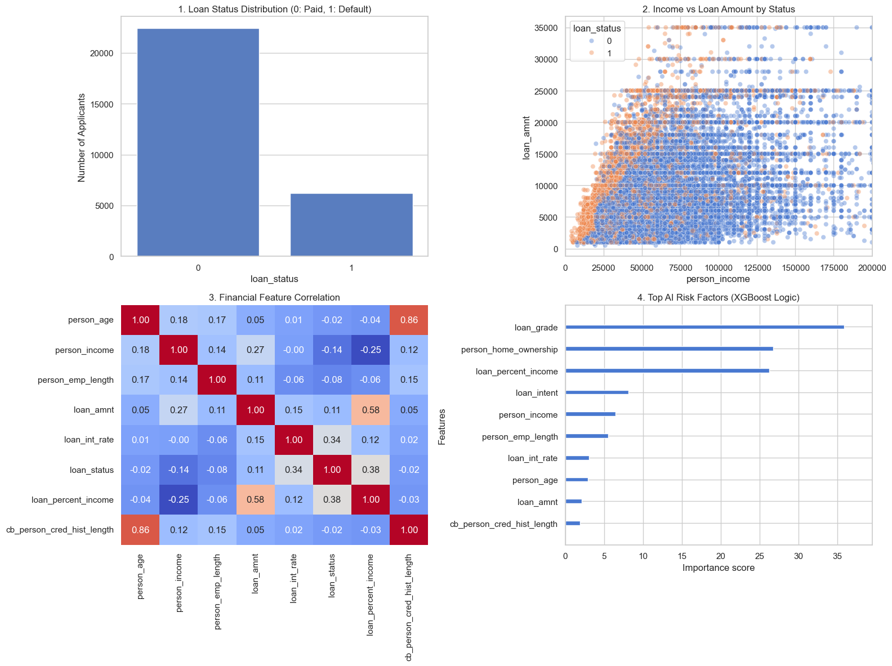

# 🏦 AI Credit Risk Assessor

**🚀 [Click here to launch the Live Web Application!](https://ai-credit-risk-predictor-ceqrqwh6h3xxqcpcu2x9mb.streamlit.app/)**

An end-to-end Machine Learning web application designed to predict the probability of bank loan defaults based on an applicant's financial profile.

### 🎯 Objective
To provide a fast, lightweight, and highly accurate risk assessment tool that financial institutions can use to evaluate loan applications and minimize default rates.

### ⚙️ The Technology & Pipeline
This project bridges the gap between heavy AutoML scouting and lightweight production deployment:
* **The Scout:** Utilized AutoGluon to rapidly test and rank massive ensembles of neural networks and tree-based models.
* **The Extraction:** Identified XGBoost as the optimal algorithm for this specific financial dataset and extracted its winning mathematical hyperparameters.
* **The Deployment:** Built a custom, lightweight XGBoost Classifier using scikit-learn and pandas, dropping the heavy 3GB AutoGluon framework for a pure, production-ready .pkl file.
* **The Web App:** Deployed an interactive user interface using Streamlit.

**🏆 Final Model Accuracy: 93.80%**

### 📊 Exploratory Data Analysis & AI Logic
The dashboard below illustrates the class balance, risk clusters (income vs. loan amount), financial feature correlations, and the internal logic of the XGBoost model highlighting the top default risk factors (such as Loan Grade and Debt-to-Income Ratio).

### 💻 How to Run Locally
If you want to test this application on your own machine:
1. Clone this repository.
2. Install the dependencies by typing: pip install -r requirements.txt
3. Launch the Streamlit server by typing: python -m streamlit run app.py

---
**Developer:** Adarsh Kaushik  
**Roll No:** 24155301  
**Institution:** KIIT University | B.Tech CSE (AI/ML)
